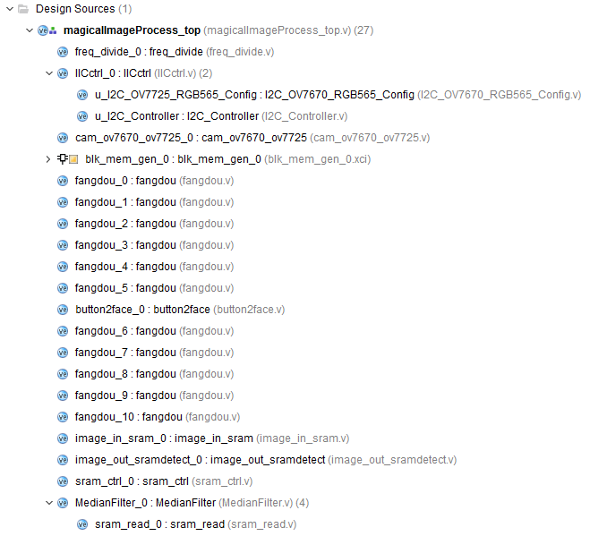
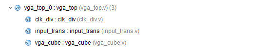

# magicalcubeImageProcess

## Function

use ov7725 camera to get pixals of right position on the surface of magiccube, which will be transfered into 3 bits color encoding through hsv encoding.

## Outputs

  6 surfaces of magiccube * 9 squares * 3 bits color encoding.
  
## Board

Xilinx FPGA EGO1 xc7a35tcsg324

## License

GPLv2.0

## Outline

## Update

#### 18.10.20 

1. finish image2magicalhsv.v
2. finish fangdou.v and button2face.v, but they are buggy

#### 18.10.29

1. image2magicalhsv.v is also buggy
2. finish div_rill_clk.v and rgb2hsv.v, they work well
3. the top file should be modified into sequential logic design 

#### 18.10.30

1. Architecture is ready
2. finish image_in_sram.v

#### 18.10.31

1. finish image_out_sramdetect.v
2. link rgb2hsv_clk module to the top state machine
3. finish hsv2color_coding.v
4. finish magic_side_data_set.v
5. this project is synthesized and implemented, but not tested.

#### 18.11.1

1. declare GPLv2.0 licence
2. update outline
3. all tested except camera

#### 18.11.11

1. camera module works well, thank xilinx's official code 
2. vga output module works well, thank tongtong
3. cam_ov7670_ov7725 module can work when image is 600 * 800
4. image_out_sramdetect module's rgb565 is the average value of four pixels
5. hsv2color_coding module adopts minimum distance algorithm

#### 18.11.20

1. in order to reduce the influence of pepper noise and gaussian noise, add median filter module and mean filter module
2. new branch for filter modules
3. vga module can show images from bram and sram

#### 18.11.21

1. filter modules are finished and tested.
2. debug kill me one day
3. merge denoise to master